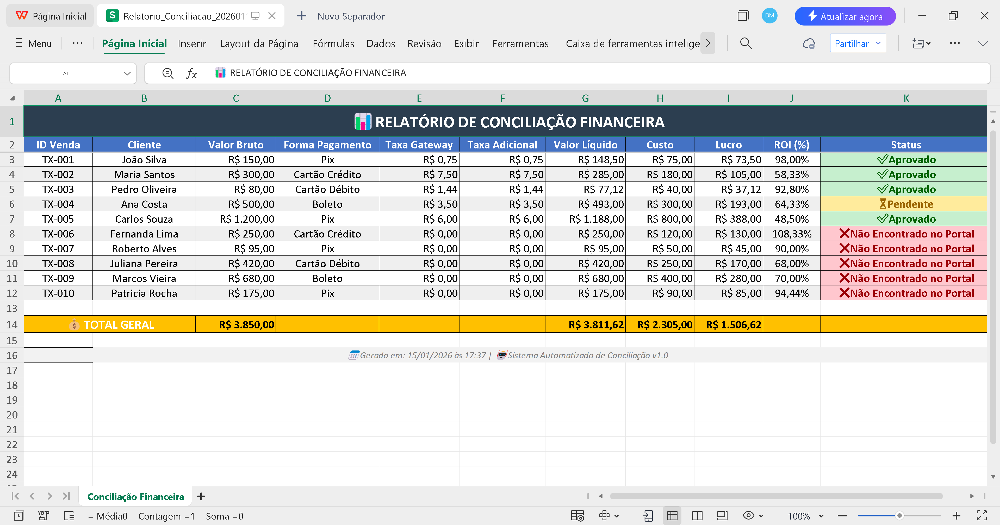
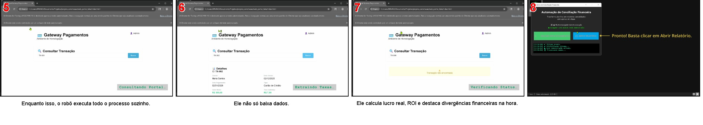
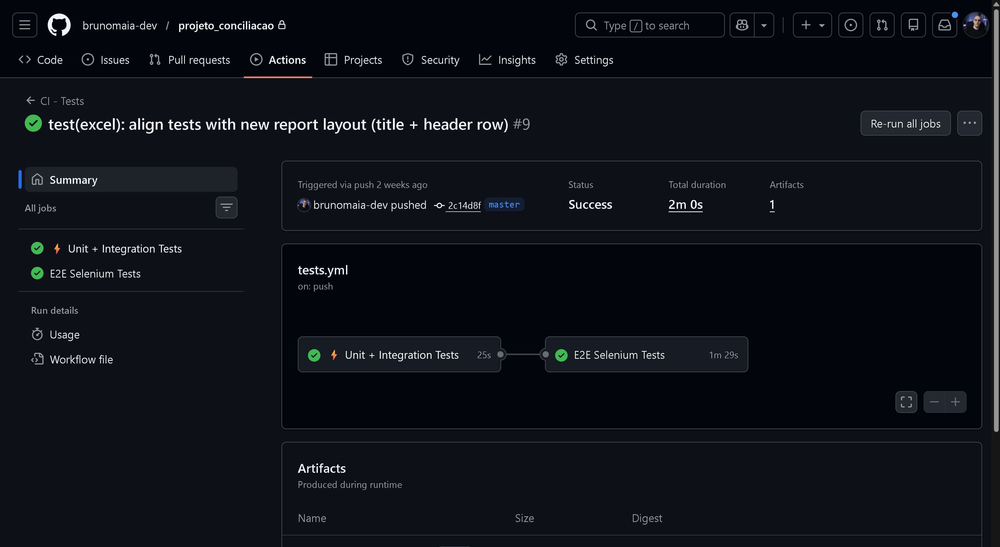

# 📊 Sistema de Conciliação Financeira Automatizada

> **Sistema profissional de conciliação financeira** que automatiza processos manuais,
> economizando até **20 horas/mês** e eliminando erros humanos.

---

## 🎥 **Demonstração**

### Vídeo Completo (1 minuto e 24 segundos)

Clique na imagem abaixo para assistir ao sistema em funcionamento:

---

## 🚀 **O que o Sistema Faz?**

1. ✅ Lê planilha Excel com centenas de vendas
2. ✅ Consulta automaticamente status no portal de pagamentos (Selenium)
3. ✅ Aplica regras financeiras complexas (taxas, MDR, ROI)
4. ✅ Detecta divergências e transações pendentes
5. ✅ Gera relatório Excel profissional formatado
6. ✅ Executa testes automatizados e CI/CD

**Resultado:** Processo que levava 4 horas vira 5 minutos.

---

## 📊 **Screenshots**

### Relatório Final Gerado

### Portal de Pagamentos (Automação)

### Pipeline CI/CD

---

## 🧠 **Tecnologias Utilizadas**

- **Backend:** Python 3.13
- **Automação Web:** Selenium WebDriver (Chrome/Edge)
- **Processamento:** Pandas, NumPy
- **Relatórios:** OpenPyXL, XlsxWriter
- **Testes:** Pytest (43 testes, 89% cobertura)
- **CI/CD:** GitHub Actions
- **Arquitetura:** Clean Code, SOLID, TDD

> 📂 Para detalhes técnicos, veja [docs/arquitetura.md](docs/arquitetura.md)

---

## 💼 **Casos de Uso Reais**

### E-commerce
Concilia vendas do Mercado Pago, PagSeguro e Cielo automaticamente.

### Contabilidade
Valida recebíveis e detecta divergências para fechamento mensal.

### Afiliados
Controla comissões e calcula ROI por produto.

> 📋 Lista completa em [docs/casos-de-uso.md](docs/casos-de-uso.md)

---

## 📈 **Métricas do Projeto**

| Métrica | Valor |
|---------|-------|
| Linhas de código | ~1.200 |
| Cobertura de testes | 89% |
| Tempo de execução | ~90s (CI) |
| Transações/minuto | ~200 |
| Navegadores suportados | Chrome, Edge |

---

## 🔐 **Código-Fonte**

Este repositório apresenta **uma demonstração funcional** do sistema.

O **código-fonte completo** é proprietário e está disponível **para avaliação técnica sob solicitação**.

### Incluído em uma contratação:
- ✅ Sistema completo pronto para uso
- ✅ Código-fonte proprietário (manutenível e extensível)
- ✅ Testes automatizados garantindo estabilidade
- ✅ Documentação técnica para evolução futura
- ✅ Pipeline CI/CD configurado
- ✅ Suporte para implantação
- ✅ 30 dias de manutenção incluídos

---

## 💬 **Precisa de Algo Parecido?**

Posso adaptar este sistema para:

- ✅ Integração com portais reais (PagSeguro, Cielo, Rede, etc.)
- ✅ Dashboards interativos (Streamlit, Power BI)
- ✅ API REST para outros sistemas
- ✅ Processamento de arquivos PDF/CSV/TXT
- ✅ Notificações automáticas (Email, Telegram)
- ✅ Agendamento de execução (Cron, Task Scheduler)

---

## 📞 **Contato**

- 📧 **Email:** br.maiadev@gmail.com
- 💼 **Instagram profissional:** @brunomaiadev

> 💡 **Respondo em até 24 horas!**

---

## 🏆 **Diferenciais**

- ✅ Código limpo e bem documentado
- ✅ Testes automatizados (menos bugs)
- ✅ Entrega no prazo
- ✅ Suporte pós-entrega
- ✅ Comunicação clara e frequente

---

## ⚖️ **Licença**

© 2025 Bruno Maia Dev. Todos os direitos reservados.

**Este é um projeto proprietário.** O código-fonte não está licenciado para uso público.
Contato para licenciamento comercial: br.maiadev@gmail.com

---

**⭐ Curtiu o projeto? Entre em contato para orçamento sem compromisso!**