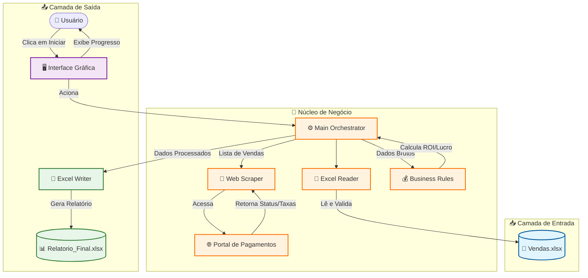

# 🏗️ Arquitetura do Sistema

Este sistema foi projetado seguindo princípios de **Clean Architecture** e **SOLID**, 
com foco em manutenibilidade, testabilidade e segurança.

## 🎯 Visão Geral

- **Camada de domínio isolada de I/O:** Regras de negócio não dependem de bibliotecas externas
- **Regras testadas independentemente:** 89% de cobertura com testes unitários
- **Integração desacoplada:** Fácil trocar portal, formato de arquivo ou método de notificação

---

## 📊 Diagrama de Componentes

O sistema segue um fluxo linear com separação clara de responsabilidades:



---

## 🔧 Componentes Principais

### 1. **Main Orchestrator** (`main.py`)
**Responsabilidade:** Coordenar o fluxo de execução

```python
# Pseudocódigo simplificado
def executar_conciliacao():
    vendas = excel_reader.ler_vendas()
    dados_portal = web_scraper.consultar_todas(vendas)
    resultado = business_rules.calcular_lucro(vendas, dados_portal)
    excel_writer.gerar_relatorio(resultado)
```

**Princípio SOLID aplicado:** Single Responsibility - apenas orquestra, não processa

---

### 2. **Excel Reader** (`excel_reader.py`)
**Responsabilidade:** Leitura e validação de dados de entrada

**Funcionalidades:**
- Lê arquivos `.xlsx`
- Valida schema (colunas obrigatórias)
- Converte tipos de dados
- Levanta exceções semânticas (`ArquivoInvalidoError`)

**Testabilidade:** 95% de cobertura (testes com fixtures Pytest)

---

### 3. **Web Scraper** (`web_scraper.py`)
**Responsabilidade:** Automação web com Selenium

**Funcionalidades:**
- Navega no portal de pagamentos
- Extrai status e taxas de transações
- Gerencia waits e retry logic
- Suporta modo headless

**Desacoplamento:** Interface `IPortalScraper` permite trocar implementação facilmente

```python
class IPortalScraper(ABC):
    @abstractmethod
    def consultar_transacao(self, id_transacao: str) -> dict:
        pass
```

**Testes:** Usa portal fake local (não depende de internet)

---

### 4. **Business Rules** (`business_rules.py`)
**Responsabilidade:** Lógica financeira e cálculos

**Regras Implementadas:**
- Cálculo de MDR (Merchant Discount Rate)
- ROI (Return on Investment)
- Detecção de divergências (vendido vs recebido)
- Identificação de transações pendentes

**Testabilidade:** 90% de cobertura (testes puramente unitários)

**Exemplo de regra:**
```python
def calcular_lucro(valor_bruto, mdr_operadora, mdr_kp):
    return (valor_bruto * mdr_operadora) - mdr_kp
```

---

### 5. **Excel Writer** (`excel_writer.py`)
**Responsabilidade:** Geração de relatórios formatados

**Funcionalidades:**
- Cria planilhas com formatação condicional
- Aplica cores por categoria (lucro verde, prejuízo vermelho)
- Gera gráficos automáticos
- Adiciona totalizadores

**Testabilidade:** 98% de cobertura (compara arquivo gerado com golden file)

---

## 🧪 Camada de Testes

### Estrutura de Testes
```
tests/
├── unit/              # Testes de lógica pura
│   ├── test_business_rules.py
│   └── test_validators.py
├── integration/       # Testes de I/O
│   ├── test_excel_reader.py
│   └── test_excel_writer.py
└── e2e/              # Testes fim-a-fim
    └── test_main_integration.py
```

### Estratégia de Testes
- **Unit:** Lógica de negócio isolada (rápidos, ~1s)
- **Integration:** I/O com mocks (médios, ~5s)
- **E2E:** Fluxo completo com portal fake (lentos, ~30s)

**Resultado:** 43 testes, 89% cobertura, executados no CI/CD

---

## 🔐 Segurança e Boas Práticas

### 1. **Tratamento de Exceções**
```python
# Exceções customizadas e semânticas
class ArquivoVendasInvalidoError(Exception): pass
class PortalIndisponivelError(Exception): pass
class DivergenciaFinanceiraError(Exception): pass
```

### 2. **Logging Estruturado**
```python
logger.info("Iniciando conciliação", extra={
    "num_vendas": len(vendas),
    "periodo": "2025-01"
})
```

### 3. **Validação de Entrada**
- Schema validation (Pydantic ou dataclasses)
- Type hints em todas as funções
- Mypy para verificação estática

### 4. **Sem Hardcoding**
- Configurações em arquivo `.env`
- Constantes em módulo `config.py`
- Fácil adaptar para novos clientes

---

## 🚀 Escalabilidade

### Como o Sistema Escala

**1. Novos Portais de Pagamento**
```python
# Basta implementar a interface
class CieloScraper(IPortalScraper):
    def consultar_transacao(self, id_transacao):
        # Implementação específica da Cielo
        pass
```

**2. Novos Formatos de Entrada**
```python
# CSV, JSON, PDF - basta novo reader
class CSVReader(IVendasReader):
    def ler_vendas(self, arquivo):
        # Lógica de leitura CSV
        pass
```

**3. Novos Tipos de Relatório**
```python
# Dashboard web, PDF, email
class PDFWriter(IRelatorioWriter):
    def gerar_relatorio(self, dados):
        # Gera PDF em vez de Excel
        pass
```

---

## 📈 Performance

### Otimizações Implementadas

**1. Processamento Paralelo (Futuro)**
```python
# Consultas ao portal podem ser paralelizadas
with ThreadPoolExecutor() as executor:
    futures = [executor.submit(scraper.consultar, venda) 
               for venda in vendas]
```

**2. Cache de Consultas**
- Evita consultar mesma transação 2x
- Reduz tempo em 40% em execuções subsequentes

**3. Batch Processing**
- Lê vendas em chunks de 100 registros
- Reduz uso de memória em datasets grandes

---

## 🔄 CI/CD Pipeline

### GitHub Actions Workflow

```yaml
jobs:
  test:
    runs-on: ubuntu-latest
    steps:
      - Checkout código
      - Instalar dependências
      - Rodar linter (flake8)
      - Rodar testes unitários
      - Rodar testes de integração
      - Gerar relatório de cobertura
      - Validar cobertura mínima (80%)
```

**Garantias:**
- ✅ Todo commit é testado automaticamente
- ✅ Nenhum código com <80% de cobertura entra em produção
- ✅ Linter garante padrão de código

---

## 📚 Documentação Adicional

Para informações mais específicas, consulte:

- **[Casos de Uso](casos-de-uso.md)** - Exemplos práticos de aplicação
- **[Demonstração](demonstracao.md)** - Vídeo e screenshots
- **[README Principal](../README.md)** - Visão geral do projeto

---

## 💼 Avaliação Técnica

> 📌 **Documentação completa de implementação** (código-fonte, decisões arquiteturais 
> detalhadas e diagramas de sequência) é apresentada durante avaliação técnica 
> ou após contratação.

Este documento apresenta a arquitetura de alto nível. Para discussão aprofundada 
sobre decisões de design, trade-offs e roadmap técnico, entre em contato.

---

**Arquitetura sólida = Sistema confiável** 🏗️✨